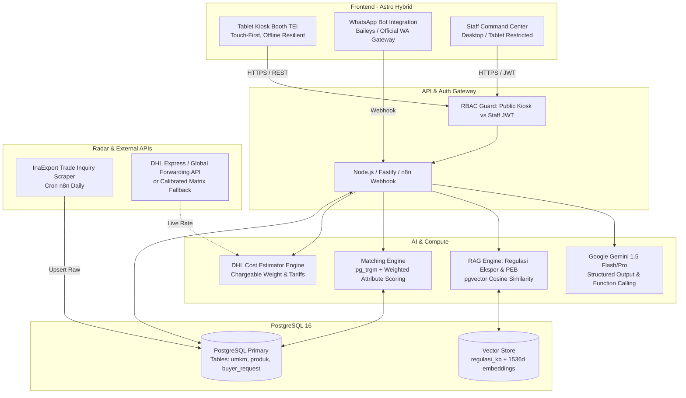

# ARCHITECTURAL SPECIFICATION: TANGSEL EXPORT AI DASHBOARD
**Project:** AI Export Advisor & Command Center Tangsel (Booth TEI 2026)  
**Target Event:** Trade Expo Indonesia 2026 (14–19 Oktober 2026, ICE BSD City)  
**Author:** Antigravity (Demiurge / S-Tier Architecture Engine)  
**Status:** DRAFT / PRODUCTION SPECIFICATION v1.0  

---

## 1. EXECUTIVE SUMMARY & OBJECTIVE

Sistem **Tangsel Export AI** adalah platform terintegrasi dua muka (*dual-facing platform*) yang dirancang khusus untuk memenangkan kehadiran Disperindag Kota Tangerang Selatan di Trade Expo Indonesia (TEI) 2026:

1. **Front-Facing (Booth Kiosk & Tablet Visitor)**: Layanan publik mandiri (self-service) bagi calon buyer internasional dan pelaku usaha lokal untuk mencari katalog komoditas unggulan Tangsel, konsultasi regulasi ekspor via AI RAG, serta simulasi biaya logistik kargo internasional (DHL Forwarding Engine).
2. **Back-Office Command Center (Staff Operational Center)**: Ruang kendali real-time untuk 5 personel Disperindag (Febri, Rama, Lukman, Syaiful, Fahmi) guna memonitor traffic booth, mengelola kurasi IKM Grade A/B/C, memproses pipeline buyer (HOT/WARM/COLD), menjalankan auto-matching InaExport radar, serta memantau Daily Workboard & KPI tim tanpa micromanagement.

```
+---------------------------------------------------------------------------------------+
|                                TANGSEL EXPORT AI ENGINE                               |
+-------------------------------------------+-------------------------------------------+
|               FRONTEND                    |                  BACKEND                  |
|  [Booth Kiosk / Tablet] (Astro Hybrid)    |  [Fastify / n8n Core API Gateway]         |
|  - Multi-language Catalog & Search        |  - Gemini 1.5 Flash / Pro (Google GenAI)  |
|  - Self-Audit Export Readiness            |  - Vector Search (PostgreSQL + pgvector)  |
|  - DHL Forwarding Logistics Simulator     |  - Fuzzy Search Engine (pg_trgm)          |
|                                           |  - InaExport Automated Trade Scraper      |
+-------------------------------------------+-------------------------------------------+
|               BACK-OFFICE                 |                 DATABASE                  |
|  [Staff Command Center] (Astro Admin)     |  [PostgreSQL 16 Enterprise]               |
|  - Live Buyer Pipeline (HOT/WARM/COLD)    |  - umkm, produk, buyer_request            |
|  - IKM Classification Matrix (A/B/C)      |  - match_result, inaexport_inquiry        |
|  - Daily Workboard & KPI 100-Point        |  - regulasi_kb (Embeddings)               |
+---------------------------------------------------------------------------------------+
```

---

## 2. HIGH-LEVEL ARCHITECTURE & TOPOLOGY



---

## 3. CORE MODULE SPECIFICATIONS

### 3.1. Front-Facing: Interactive Kiosk & Visitor Interface
Dirancang untuk tablet 10–12 inci (Landscape) di counter booth TEI 2026. Tampilan ultra-cepat, minimal friksi, dengan antarmuka bilingual (Bahasa Indonesia & English).

1. **Mode A: Buyer Product Discovery**:
   - Zero-form search: Buyer cukup mengetik produk/komoditas (misal: *"Organic Arenga Sugar"*, *"Banten Wooden Craft"*, *"Dried Herbs"*).
   - Sistem melakukan query fuzzy via `pg_trgm` dan semantic match ke tabel `produk` dan `umkm`.
   - Menampilkan card profil UMKM: Kapasitas per bulan, MOQ, sertifikasi (Halal, BPOM, HACCP, ISO), Lead time, dan foto resolusi tinggi.
   - Tombol **"Request Business Meeting / Sample"**: Menyimpan langsung ke `buyer_request` dengan status `sumber = 'booth_visitor'`. Jika score match > 70%, bot seketika mengirim alert notifikasi ke WA tim Disperindag.

2. **Mode B: UMKM Self-Audit & Onboarding**:
   - Conversational form sederhana: Nama usaha, komoditas, kapasitas produksi, sertifikasi yang dimiliki, kontak PIC.
   - **Instant AI Export Gap Analysis (Powered by Gemini)**:
     - Input: Komoditas + Negara Target (contoh: Kripik Pisang ke Uni Eropa / Timur Tengah).
     - Output instan: Menampilkan checklist kesiapan regulasi (misal: "Untuk Uni Eropa: Memerlukan sertifikasi HACCP/ISO 22000, dokumen Phytosanitary, dan pengemasan tanpa zat pewarna terlarang").
   - Status pendaftaran otomatis diberi tag `status_verifikasi = 'belum'`.

3. **Mode C: AI Logistics & Forwarding Cost Simulator (DHL Integration)**:
   - Kalkulator biaya kirim kargo ekspor berdasarkan parameter teknis:
     - Negara Asal: Indonesia (Tangerang Selatan)
     - Negara Tujuan (Dropdown: Afrika/Kamerun, UE, Timur Tengah, Asia Timur, US)
     - Berat Aktual (kg) vs Dimensi Koli (P x L x T cm)
     - Kalkulasi **Chargeable Weight**: $\max(\text{Actual Weight}, \frac{P \times L \times T}{5000})$ (Air Freight Standard)
     - Nilai FOB & Incoterms (EXW, FOB, CIF)
   - Estimasi biaya, perkiraan transit time, dan rekomendasi dokumen kepabeanan (Air Waybill, Commercial Invoice, Packing List, Certificate of Origin).

---

### 3.2. Back-Office: Staff Command Center
Dashboard operasional untuk ruang kendali internal Disperindag Tangsel:

1. **Live Lead Pipeline Board (HOT / WARM / COLD)**:
   - Mengelompokkan semua interaksi buyer dari 3 channel: **Kiosk Booth**, **WhatsApp Bot**, dan **InaExport Trade Inquiry**.
   - **Score Threshold**:
     - **HOT (> 80)**: Kategori persis cocok, sertifikasi lengkap, kapasitas memenuhi demand. Langsung diarahkan ke Rama untuk penjadwalan pitching tatap muka di booth.
     - **WARM (60–79)**: Kategori cocok namun sertifikasi parsial atau MOQ perlu dinegosiasikan.
     - **COLD (< 60)**: Permintaan belum selaras dengan komoditas binaan Tangsel aktif.

2. **IKM Export Readiness Master (A / B / C Matrix)**:
   - Dipegang oleh **Febri** (Lead IKM & Export Readiness):
     - **Grade A (Siap Ekspor)**: Legalitas lengkap (NIB, NPWP), Sertifikasi Internasional (Halal/HACCP/BPOM/ISO), Kemasan ekspor, supply chain stabil. Siap ditampilkan di katalog utama TEI.
     - **Grade B (Potensial - Minor Gap)**: Kualitas dan kapasitas mumpuni, namun kurang sertifikasi target negara tertentu atau kemasan belum berbahasa Inggris.
     - **Grade C (Inkubasi)**: Usaha mikro lokal, kapasitas terbatas, belum memenuhi standar sanitasi/regulasi internasional.

3. **InaExport Radar & Automated Matching**:
   - Menampilkan feed otomatis inquiry ekspor nasional dari Kemendag (`inaexport.id/front_end/ourinqueris`).
   - Kartu menampilkan: Komoditas dicari, negara buyer, tanggal posting, dan match score dengan UMKM Tangsel.
   - Tombol **"Hubungkan IKM"**: Mengirim drafting brief peluang ekspor ke IKM terkait via WhatsApp.

4. **Team Daily Workboard & 100-Point KPI Module**:
   - Diisi mandiri oleh personel (Febri, Rama, Lukman, Syaiful, Fahmi):
     - **Morning Plan (08.00–08.30)**: Prioritas tugas, target deliverable, kendala.
     - **End-of-Day Update (15.30–16.00)**: Realisasi output, attachment evidence link, status warna (GREEN / YELLOW / RED).
   - **KPI 100-Point Formula**:
     $$\text{Total Score} = \text{Disiplin (30)} + \text{Output (45)} + \text{Quality (15)} + \text{Reporting (10)}$$
   - Pimpinan (Kadis) cukup memantau exception board (Yellow/Red) tanpa micromanagement harian.

---

## 4. DATABASE SCHEMA (POSTGRESQL 16 + EXTENSIONS)

Sistem menggunakan database PostgreSQL dengan ekstensi `pgcrypto`, `pg_trgm` (fuzzy matching nama produk), dan `vector` (RAG embedding 1536 dimensi).

```sql
-- 1. Ekstensi
CREATE EXTENSION IF NOT EXISTS "uuid-ossp";
CREATE EXTENSION IF NOT EXISTS "pg_trgm";
CREATE EXTENSION IF NOT EXISTS "vector";

-- 2. Master IKM / UMKM
CREATE TABLE umkm (
    id SERIAL PRIMARY KEY,
    source TEXT CHECK (source IN ('disperindag_binaan', 'gmaps', 'self_input', 'tei_walkin')) NOT NULL,
    nama_usaha TEXT NOT NULL,
    kecamatan TEXT NOT NULL,
    alamat TEXT,
    kontak_nama TEXT,
    kontak_wa TEXT NOT NULL,
    email TEXT,
    deskripsi TEXT,
    grade_kesiapan TEXT DEFAULT 'C' CHECK (grade_kesiapan IN ('A', 'B', 'C')),
    status_verifikasi TEXT DEFAULT 'belum' CHECK (status_verifikasi IN ('belum', 'terverifikasi', 'siap_ekspor')),
    foto_url TEXT,
    nib TEXT,
    created_at TIMESTAMPTZ DEFAULT now(),
    updated_at TIMESTAMPTZ DEFAULT now(),
    UNIQUE (nama_usaha, kecamatan)
);

-- 3. Katalog Produk
CREATE TABLE produk (
    id SERIAL PRIMARY KEY,
    umkm_id INT REFERENCES umkm(id) ON DELETE CASCADE,
    nama_produk TEXT NOT NULL,
    kategori TEXT CHECK (kategori IN ('food_beverage', 'manufaktur', 'kawasan_industri', 'fashion_kerajinan', 'furniture_dekor', 'lainnya')) NOT NULL,
    hs_code TEXT,
    deskripsi_spesifikasi TEXT,
    kapasitas_produksi_bulanan TEXT,
    moq TEXT,
    harga_fob_usd NUMERIC(10,2),
    sertifikasi TEXT[] DEFAULT '{}', -- e.g. {'Halal', 'BPOM', 'HACCP', 'ISO22000'}
    dimensi_kemasan_cm JSONB,       -- {"p": 20, "l": 15, "t": 10, "berat_kg": 0.5}
    foto_produk_urls TEXT[],
    created_at TIMESTAMPTZ DEFAULT now()
);

-- 4. Buyer Requests & Leads
CREATE TABLE buyer_request (
    id SERIAL PRIMARY KEY,
    sumber TEXT CHECK (sumber IN ('booth_visitor', 'wa_bot', 'inaexport_sync', 'manual_entry')) NOT NULL,
    nama_buyer TEXT,
    perusahaan TEXT,
    negara_asal TEXT NOT NULL,
    kontak_email TEXT,
    kontak_wa TEXT,
    kategori_dicari TEXT NOT NULL,
    spesifikasi_kebutuhan TEXT NOT NULL,
    volume_estimasi TEXT,
    target_incoterms TEXT DEFAULT 'FOB',
    status_opportunity TEXT DEFAULT 'COLD' CHECK (status_opportunity IN ('HOT', 'WARM', 'COLD', 'DEAL', 'DROPPED')),
    pic_assigned TEXT, -- 'Febri' | 'Rama' | 'Syaiful' | 'Lukman' | 'Fahmi'
    created_at TIMESTAMPTZ DEFAULT now()
);

-- 5. Matching Engine Results
CREATE TABLE match_result (
    id SERIAL PRIMARY KEY,
    buyer_request_id INT REFERENCES buyer_request(id) ON DELETE CASCADE,
    produk_id INT REFERENCES produk(id) ON DELETE CASCADE,
    score NUMERIC(5,2) NOT NULL, -- 0.00 - 100.00
    alasan_matching TEXT,
    notified_to_staff BOOLEAN DEFAULT false,
    staff_action_status TEXT DEFAULT 'pending' CHECK (staff_action_status IN ('pending', 'dihubungi', 'pitching_scheduled', 'closed_deal', 'rejected')),
    created_at TIMESTAMPTZ DEFAULT now()
);

-- 6. InaExport Inquiry Scraped Data
CREATE TABLE inaexport_inquiry (
    inaexport_id TEXT PRIMARY KEY,
    produk_nama TEXT NOT NULL,
    tanggal TEXT,
    buyer_negara TEXT,
    qty_order_raw TEXT,
    masa_aktif TEXT,
    jumlah_download TEXT,
    scraped_at TIMESTAMPTZ DEFAULT now(),
    matched_produk_id INT REFERENCES produk(id),
    match_score NUMERIC(5,2),
    match_processed BOOLEAN DEFAULT false
);

-- 7. Knowledge Base Regulasi Ekspor (RAG)
CREATE TABLE regulasi_kb (
    id SERIAL PRIMARY KEY,
    judul TEXT NOT NULL,
    kategori_produk TEXT NOT NULL,
    negara_tujuan TEXT NOT NULL,
    isi_ringkas TEXT NOT NULL,
    dokumen_wajib TEXT[],
    sumber_regulasi TEXT,
    embedding VECTOR(1536),
    updated_at TIMESTAMPTZ DEFAULT now()
);

-- 8. Daily Workboard & Staff KPI Log
CREATE TABLE daily_workboard (
    id SERIAL PRIMARY KEY,
    tanggal DATE NOT NULL,
    personel_nama TEXT CHECK (personel_nama IN ('Febri', 'Rama', 'Lukman', 'Syaiful', 'Fahmi')) NOT NULL,
    prioritas_pagi TEXT NOT NULL,
    target_output TEXT NOT NULL,
    deadline_jam TIME,
    kendala_dependency TEXT,
    realisasi_sore TEXT,
    evidence_url TEXT,
    status_color TEXT DEFAULT 'GREEN' CHECK (status_color IN ('GREEN', 'YELLOW', 'RED')),
    catatan_evaluasi TEXT,
    created_at TIMESTAMPTZ DEFAULT now(),
    updated_at TIMESTAMPTZ DEFAULT now(),
    UNIQUE (tanggal, personel_nama)
);

CREATE TABLE monthly_kpi (
    id SERIAL PRIMARY KEY,
    bulan_tahun TEXT NOT NULL, -- 'Agustus 2026', 'September 2026', 'Oktober 2026'
    personel_nama TEXT NOT NULL,
    skor_disiplin NUMERIC(4,2) DEFAULT 0 CHECK (skor_disiplin <= 30),
    skor_output NUMERIC(4,2) DEFAULT 0 CHECK (skor_output <= 45),
    skor_quality NUMERIC(4,2) DEFAULT 0 CHECK (skor_quality <= 15),
    skor_reporting NUMERIC(4,2) DEFAULT 0 CHECK (skor_reporting <= 10),
    total_skor NUMERIC(5,2) GENERATED ALWAYS AS (skor_disiplin + skor_output + skor_quality + skor_reporting) STORED,
    status_performa TEXT,
    catatan_pimpinan TEXT,
    UNIQUE (bulan_tahun, personel_nama)
);
```

---

## 5. MATCHING & LOGISTICS ALGORITHMS

### 5.1. Matching Engine Formula
Setiap kali ada demand baru (dari Booth, WhatsApp, atau InaExport scraper), algoritma menghitung kecocokan komparatif:

$$\text{Final Score} = (S_{\text{kategori}} \times 0.50) + (S_{\text{sertifikasi}} \times 0.30) + (S_{\text{kapasitas}} \times 0.20)$$

- **Kategori Similarity ($S_{\text{kategori}}$)**: Diukur menggunakan `pg_trgm` similarity antara teks kebutuhan buyer dan katalog produk:
  ```sql
  SELECT similarity(p.nama_produk, :buyer_query) AS cat_score ...
  ```
- **Sertifikasi Matching ($S_{\text{sertifikasi}}$)**: Rasio kelengkapan sertifikasi wajib negara tujuan yang sudah dimiliki IKM (misal butuh Halal + HACCP, jika punya keduanya = 100%, punya 1 = 50%).
- **Kapasitas Matching ($S_{\text{kapasitas}}$)**: Validasi apakah volume order buyer $\le$ kapasitas produksi bulanan IKM.

### 5.2. Air/Ocean Freight Logistics Estimator (DHL Proxy Engine)
Kalkulator di Kiosk dan Backend menggunakan formula standar forwarding:

1. **Air Freight Chargeable Weight Calculation**:
   $$\text{Volumetric Weight (kg)} = \frac{\text{Length (cm)} \times \text{Width (cm)} \times \text{Height (cm)}}{5000}$$
   $$\text{Chargeable Weight} = \max(\text{Gross Weight}, \text{Volumetric Weight})$$

2. **Total Logistics Cost Estimate**:
   $$\text{Estimated Cost} = \text{Base Freight Rate}(\text{Origin, Dest, CW}) + \text{Fuel Surcharge} + \text{Customs Clearance Fee} + \text{Documentation (COO/PEB)}$$

---

## 6. ROLE & ACCESS PERMISSION MATRIX (RBAC)

| Peran | Pengguna | Hak Akses Utama |
|---|---|---|
| **Public Visitor** | Calon Buyer / UMKM | Akses Kiosk Mode: Cari Produk, Onboarding UMKM, RAG Ekspor, Simulasi DHL. |
| **Lead IKM** | **Febri** | Master Database IKM, Verifikasi Legalitas & Grade A/B/C, Gap Analysis. |
| **Lead Buyer & Matching** | **Rama** | Pipeline Buyer (HOT/WARM/COLD), Matching Engine, Jadwal Pitching Booth. |
| **Finance & Vendor** | **Lukman** | Status Anggaran Booth, Vendor Kontraktor, Administrasi SPK & Pembayaran. |
| **Administrative Support** | **Syaiful** | Tele-verifikasi IKM, Pengumpulan Berkas & Foto Produk, Log Kontak Harian. |
| **Operational Support** | **Fahmi** | Manajemen Arsip Evidence, Dokumentasi Simulasi, Support Kiosk Hardware. |
| **Pengarah / Pimpinan** | **Kepala Dinas** | Executive Summary Dashboard, Monitoring Exception Board (Yellow/Red), Review Bulanan KPI. |

---

## 7. TIMELINE IMPLEMENTASI & MILESTONE TEI 2026

Target: **14 Oktober 2026** (Hari-H Booth TEI 2026 di ICE BSD) — Sisa **H-20**:

| Fase | Periode | Output Kunci |
|---|---|---|
| **Fase 1: Core Scaffolding & DB** | H-20 s/d H-16 (24–28 Sep) | Init Astro project di `D:\code\tangsel-export-ai`, setup PostgreSQL schema, migrasi data master IKM Disperindag. |
| **Fase 2: AI & Matching Integration** | H-15 s/d H-11 (29 Sep–3 Okt) | Pasang Google GenAI SDK (Gemini RAG), bangun scraper InaExport, implementasi DHL Logistics Simulator. |
| **Fase 3: Kiosk & Command Center UI** | H-10 s/d H-6 (4–8 Okt) | Desain UI touch tablet 10" kiosk, bangun Staff Command Center & Workboard KPI. |
| **Fase 4: Testing & Staff Simulation** | H-5 s/d H-2 (9–12 Okt) | Uji beban offline fallback, simulasi roleplay pitching buyer (Febri, Rama, Syaiful, Fahmi). |
| **Fase 5: Deployment & Go-Live** | H-1 s/d H-Day (13–14 Okt) | Instalasi tablet di booth ICE BSD, integrasi WA notification live. |

---

## 8. SECURITY & DATA GOVERNANCE COMPLIANCE
1. **Zero Hardcoded Secrets**: Semua credential database, API token Gemini, dan service role disimpan di `.env.local` (di-ignore oleh git).
2. **Offline-Resilient Kiosk**: Kiosk UI menggunakan caching PWA / Local Storage untuk katalog dasar agar jika koneksi GSM di ICE BSD padat/down, pencarian katalog UMKM tetap berjalan lancar.
3. **Data Integrity**: Kontak pribadi buyer dan kontak pemilik UMKM dilindungi token otentikasi; tidak diekspos ke publik tanpa konfirmasi tindakan.
